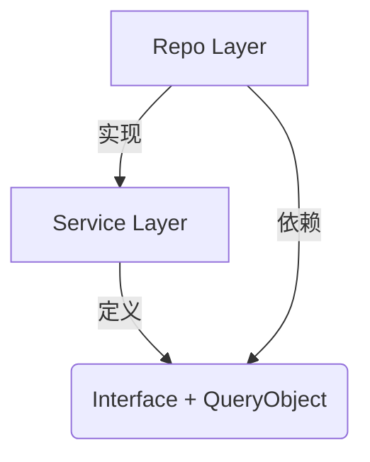
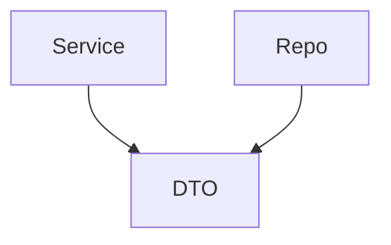
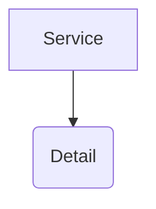

# Go 架构学习笔记：QueryObject 定义位置探讨

## 背景
在 Go 的分层架构中，我们遵循 **"接口由使用者定义" (Interface defined by consumer)** 的哲学。
通常 Service 层是 Repository 接口的使用者，因此 Repository 接口应该定义在 Service 包中。

**核心问题**：当 Repository 接口的方法需要复杂的查询参数（如 `QueryObject`）时，这个 `QueryObject` 结构体应该定义在哪里？

---

## 核心原则：依赖倒置 (DIP)

> High-level modules should not depend on low-level modules. Both should depend on abstractions.
> 抽象不应该依赖细节，细节应该依赖抽象。

在我们的场景中：
*   **高层模块**：Service (业务逻辑)
*   **低层模块**：Repository Implementation (DB 实现)
*   **抽象/契约**：Repository 接口 + **方法参数类型 (QueryObject)**

因此，`QueryObject` 作为**契约**的一部分，属于高层定义，应该由低层去依赖。

---

## 三种方案深度对比

### 方案 1：定义在 Service 层 (推荐 ✅)

Service 包同时定义接口和查询参数结构体。Repo 包实现时导入 Service 包中定义的类型。

#### 代码结构
```go
// internal/service/member/service.go
package member

// 1. Service 定义查询需求 (契约的一部分)
type UserQuery struct {
    Mobile   *string
    Status   *int
    PageNo   int
    PageSize int
}

// 2. Service 定义接口
type Repository interface {
    // 使用自己定义的 Query 类型
    Find(ctx context.Context, q *UserQuery) ([]*model.User, error)
}
```

```go
// internal/repo/member/repo.go
package repo

import "my-project/internal/service/member" // ✅ 导入 Service 包获取契约

// 3. Repo 实现依赖 Service 定义的契约
type RepoImpl struct{}

func (r *RepoImpl) Find(ctx context.Context, q *member.UserQuery) ([]*model.User, error) {
    // 具体的 GORM 实现
}
```

#### 依赖关系


#### 评价
*   **符合 Go 哲学**：完全遵循"接口由使用者定义"。
*   **业务语义**：QueryObject 表达的是**业务查询需求**，本质上属于业务层。
*   **误区澄清**：Repo 导入 Service 包**并不违反架构原则**。Repo 依赖的是 Service 定义的**数据契约 (Type)**，而不是 Service 的**业务逻辑实现**。

---

### 方案 2：定义在共享包 (如 dto/ 或 query/) (可选 🆗)

将查询对象放入独立的包中，Service 和 Repo 都依赖它。

#### 代码结构
```go
// internal/dto/query.go
package dto
type UserQuery struct { ... }

// internal/service/member/service.go
import "my-project/internal/dto"
type Repository interface {
    Find(ctx context.Context, q *dto.UserQuery) ...
}

// internal/repo/member/repo.go
import "my-project/internal/dto"
func (r *RepoImpl) Find(ctx context.Context, q *dto.UserQuery) ...
```

#### 依赖关系


#### 评价
*   **适用场景**：大型项目、微服务、或者 QueryObject需要在多个不同 Service 间复用时。
*   **缺点**：对于简单项目，增加了一个额外的包，稍显繁琐。

---

### 方案 3：定义在 Repo 层 (反模式 ❌)

Repo 层定义 QueryObject，Service 层导入使用。

#### 代码结构
```go
// internal/repo/repo.go
package repo
type UserQuery struct { ... } // ❌ Repo 定义
type Repository interface { ... }

// internal/service/service.go
package service
import "my-project/internal/repo" // ❌ Service 依赖 Repo 的具体类型

func (s *Service) List() {
    q := repo.UserQuery{...} // 耦合了底层细节
}
```

#### 依赖关系


#### 评价
*   **违反 DIP**：高层(Service) 依赖了低层(Repo) 的定义。
*   **循环依赖风险**：如果 Repo 实现需要调用 Service 的某些公共方法（虽然少见），会立即导致循环依赖。
*   **测试困难**：Service 此时强绑定于 Repo 包，难以 Mock。

---

## 最佳实践总结

1.  **Repository 方法参数原则**：
    *   **参数 ≤ 3 个**：直接使用基本类型 (`id int64`, `mobile string`)。简单直接。
    *   **参数 > 3 个 / 复杂筛选**：使用 `QueryObject` 结构体。

2.  **QueryObject 定义位置**：
    *   **首选**：**Service 层**。QueryObject 是接口契约的一部分，应与 interface 定义在一起。Repo 层的实现去引用 Service 层的定义。
    *   **备选**：**internal/dto 层**。如果 QueryObject 需要在多个模块复用，或者为了解决某些特殊的循环引用问题。

3.  **Repository 方法返回值**：
    *   通常返回 **Domain Model** (`internal/model`)。
    *   如果是聚合统计数据，返回 **internal/dto**。
    *   **绝不**返回 API 层的 `Req/Resp` 对象。

## 一句话总结
> **接口和它的输入参数类型（QueryObject）共同构成了"契约"。在 Go 架构中，契约属于使用者（Service），实现者（Repository）应当依赖这个契约，而不是反过来。**
